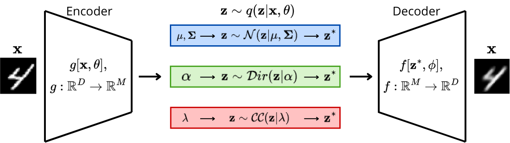

# Variational Autoencoders With Alternative Bottlenecks  



This repository contains the implementation for our Deep Learning project at DTU (course 02456), where we investigate how different latent bottlenecks affect the behaviour of a Variational Autoencoder (VAE).  
Specifically, we compare:

- **Gaussian VAE** (standard)
- **Dirichlet VAE** (simplex-constrained latent space)
- **Continuous Categorical (CC) VAE** (a newer exponential-family simplex distribution)

Our code and experiments are included in the repository.  
See the full project report for details on code the theoretical foundations and experimental results.  See [**Explainer_Notebook.ipynb**](Explainer_Notebook.ipynb) for explanations of the code, however refer to description below of how to execute the project as a module from the terminal.

## Authors

| Name | Student ID |
|------|------------|
| Olivia Sommer Droob | S214696 |
| Karoline Klan Hansen | S214638 |
| Martha Falkesgaard Nybroe | S214692 |
| Signe Djernis Olsen | S206759 |
| Bella Strandfort | S214205 |

## Project structure

The directory structure of the project looks like this:
```txt
├── configs/                        # Configuration files
├── data/                           # Data directory
├── models/                         # Trained models
├── notebooks/                      # Jupyter notebooks
├── reports/                        # Reports
│   └── figures/                    # Latent spaces & reconstructions from trainings and evaluation
├── src/                            # Source code
│   ├── deep_project/
│   │   ├── __init__.py
│   │   ├── api.py
│   │   ├── data.py
│   │   ├── evaluate.py
│   │   ├── evaluate_multiple.py    # evaluate 3 final models for the final project
│   │   ├── models.py               # Gaussian, Dirichlet, CC implementations
│   │   ├── simplex.py              # specific simplex visualizations
│   │   ├── train.py
│   │   └── visualize.py
├── .gitignore
├── README.md                 # Project README
├── requirements.txt          # Project requirements
```

Created using [mlops_template](https://github.com/SkafteNicki/mlops_template),
a [cookiecutter template](https://github.com/cookiecutter/cookiecutter) for getting
started with Machine Learning Operations (MLOps).

# Running the Project

All scripts are executed using **Hydra**, allowing configuration overrides directly from the command line.


## Key configurations
Default runs uses the configurations in `base_config.yaml`, and most important configurations include:
```yaml
#dataset
dataset: mnist                  # "mnist" | "medmnist"
medmnist_subset: organcmnist    # only used if dataset=medmnist
mnist_classes: [0,1]            # Which classes of Mnist to load, if null defaults to "all", else list of ints e.g. [0,1,2]

#model
model_name: cc                  # gaussian | dirichlet | cc , select here which type of model to train
latent_dim: 10

# trainer
epochs: 200
lr: 4e-4
device: auto                    # "cuda" | "cpu" | "auto"
early_stop_patience: 10         # epochs with no improvement before stopping
early_stop_min_delta: 0.05      # required improvement in val_loss to reset patience

# visualization
viz_every: 5                    # or 1 if you want plots every epoch
```

If wanting to run a hyperparameter sweep of different models refer to `wandb_sweep_config.yaml`


## **1. Train a model**

Default run (uses configs/base_config.yaml):

```bash
python -m src.deep_proj.train
```

Run with disables weights and biases:
```bash
python -m src.deep_proj.train wandb.enabled=false
```

Choose bootleneck type, select dataset or overwrite other hyperparameters:
```bash
python -m src.deep_proj.train model_name=gaussian
python -m src.deep_proj.train model_name=dirichlet
python -m src.deep_proj.train model_name=cc

python -m src.deep_proj.train dataset=mnist
python -m src.deep_proj.train dataset=medmnist

python -m src.deep_proj.train dataset=mnist
python -m src.deep_proj.train dataset=medmnist
```
### Running WandB Sweeps

The sweep configuration is defined in configs/`wandb_sweep_config.yaml`
```bash
wandb sweep configs/wandb_sweep_config.yaml
wandb agent <sweep_id>
```

# Visualization and Evaluation

Training automatically outputs:
- Reconstruction grids
- t-SNE latent-space embeddings
- Loss curves
Outputs are saved under:

```
├── reports/                        
│   └── figures/   
│   └──--- model_run_name/   
```

Model checkpoints are saved under:
```
├── models/     
```

For comparison of 3 trained models hardcode the paths to the model.pt files in `evaluate_multiple.py` and run:
```bash
python -m src.deep_proj.evaluate_multiple

```
